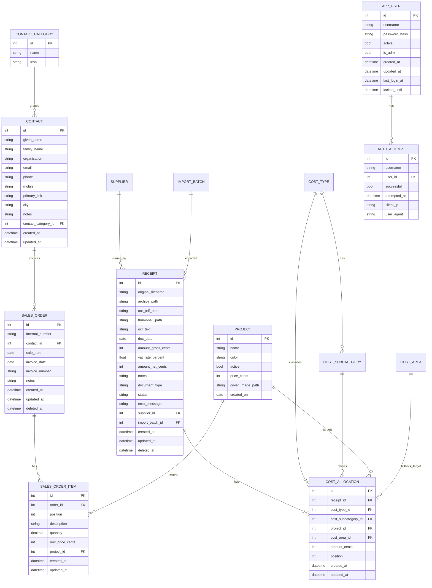

# Datenbankstruktur

Quelle: `belegmanager/models.py`, `belegmanager/db.py`, `belegmanager/fts.py`  
Version-Single-Source: `pyproject.toml` (`0.2`)

## Überblick
Die App nutzt SQLite mit SQLModel/SQLAlchemy.  
Hauptfokus liegt auf:
- `receipt` als Beleg-Stammsatz,
- `sales_order` + `sales_order_item` für Verkäufe / Ausgangsrechnungen,
- `cost_allocation` als fachliche Zuordnungs-Wahrheit,
- Stammdaten (`project`, `supplier`, `contact`, `contact_category`, `cost_type`, `cost_subcategory`),
- Auth-Basis (`app_user`, `auth_attempt`).

Zusatz:
- `receipt_fts` (FTS5) für Volltextsuche auf OCR-/PDF-Text.
- `import_batch` für Import-Statistik.

## ER-Übersicht (vereinfacht)

## Tabellen und fachliche Rolle
- `receipt`: Belegkopf inkl. Betrag, optionalen Notizen, Typ (`invoice`/`credit_note`), OCR-Status, Soft-Delete.
- `sales_order`: Verkaufskopf mit internem Nummernkreis, Pflicht-Kontakt, Verkaufs-/Rechnungsdatum und Soft-Delete.
- `sales_order_item`: einfache Positionszeilen pro Verkauf; Projekt ist optional, Gesamtwerte werden aus Menge x Einzelpreis berechnet.
- `cost_allocation`: eine oder mehrere Zuordnungszeilen pro Beleg; Summe muss Beleg-Brutto entsprechen.
- `cost_type`: Kostenkategorie (aktiv/archiviert).
- `cost_subcategory`: Unterkategorie je Kostenkategorie, inkl. systemseitigem Default.
- `project`: Projektstammdaten inkl. Aktiv-Status und optionalem `price_cents` zur Preisverwaltung.
- `cost_area`: technische Zielstruktur; UI-seitig aktuell ausgeblendet, u. a. für Default-Fallback.
- `supplier`: Anbieter/Lieferant.
- `contact_category`: einfache Kontaktkategorie ohne Unterkategorien; Löschen wird blockiert, solange Kontakte zugeordnet sind.
- `contact`: personenbasierter Kontakt mit genau einer Kategorie; aktuell ohne Soft-Delete oder Archivierung.
- Kontakte dürfen nicht gelöscht werden, solange Verkäufe auf sie referenzieren.
- Projekte dürfen nicht gelöscht werden, solange Beleg-Zuordnungen oder Verkaufspositionen auf sie referenzieren.
- `import_batch`: Importlauf (Zählwerte und Zeiten).
- `app_user`: lokaler Login-Benutzer (Argon2-Hash, Status, Lockout-Metadaten).
- `auth_attempt`: Login-Versuchsprotokoll für Lockout/Monitoring.

## Wichtige technische Konventionen
- Geldwerte in `*_cents` als Integer gespeichert.
- Verkaufsmengen liegen als `Decimal(12,3)` vor; Zeilensummen werden kaufmännisch auf Cent gerundet.
- Timestamps in UTC.
- Soft-Delete über `receipt.deleted_at` und `sales_order.deleted_at`.
- Volltextsuche über FTS5-Tabelle `receipt_fts(receipt_id, content)`.

## Migration, Seeds und Schema-Reset
Initialisierung in `db.init_db()`:
1. `_ensure_schema_state()`:
   - vergleicht Marker `data/schema_version.txt` mit internem `SCHEMA_VERSION`.
   - bei Abweichung: **Hard Reset** (DB-Datei + Archivordner neu).
2. `SQLModel.metadata.create_all(engine)`
3. `_apply_additive_migrations(session)`:
   - fügt fehlende Spalten idempotent hinzu (z. B. `receipt.document_type`, `receipt.notes`, `cost_type.active`, `project.price_cents`, ...).
4. `init_fts(session)` für `receipt_fts`
5. `_seed_defaults(session)`:
   - Default-Kontaktkategorien
   - Default-Kostenkategorien und Default-Unterkategorien
   - technische Default-Kostenstelle `Allgemeine Ausgabe`
   - Indexe für wichtige Filter/Join-Felder

## Warum diese Struktur
- Belegkopf + Zuordnungszeilen trennt Stammdaten und fachliche Verteilung sauber.
- Integer-Cents vermeiden Floating-Fehler bei Summen/Validierung.
- Soft-Delete bewahrt Historie und erlaubt Wiederherstellung.
- FTS5 in SQLite liefert lokal schnelle Suche ohne externen Dienst.
