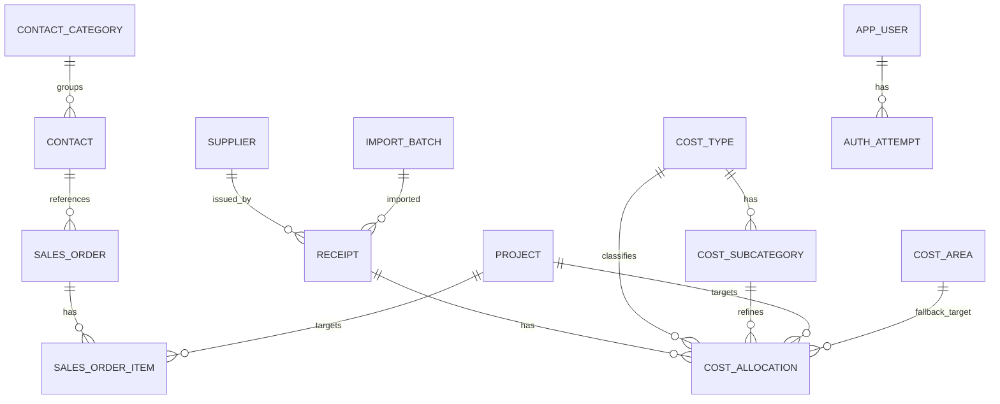

# Datenbankstruktur

Quelle: `belegmanager/models.py`, `belegmanager/db.py`, `belegmanager/fts.py`  
Version-Single-Source: `pyproject.toml` (`0.2`)

## Überblick
Atelier Buddy nutzt SQLite mit SQLModel/SQLAlchemy. Das Datenmodell ist auf lokale Nutzung, überschaubare Betriebsgröße und schnelle Iteration ausgelegt.

Zentrale Bereiche:
- `receipt` für importierte oder manuell gepflegte Belege
- `cost_allocation` als fachliche Zuordnungs-Wahrheit für Ausgaben
- `sales_order` und `sales_order_item` für Verkäufe bzw. Ausgangsrechnungen
- Stammdaten für Projekte, Kontakte, Kontaktkategorien, Anbieter und Kategorien
- `receipt_fts` für lokale Volltextsuche
- `app_user` und `auth_attempt` für Anmeldung und Lockout-Basis

## ER-Übersicht

## Zentrale Tabellen
### `receipt`
Belegkopf mit Dokumentpfaden, OCR-Text, Belegdatum, Bruttobetrag, USt, Netto, Typ, Status und Soft-Delete.

### `cost_allocation`
Zuordnungszeilen für Ausgaben. Diese Tabelle ist die fachliche Wahrheit für Kostenkategorie, Unterkategorie, optionales Projekt, optionale technische Kostenstelle und Betrag.

### `sales_order`
Verkaufskopf mit:
- interner Verkaufsnummer
- Pflicht-Kontakt
- Verkaufsdatum
- optionalem Rechnungsdatum
- optionaler, eindeutiger Rechnungsnummer
- Notiz
- Soft-Delete

In v0.2 gibt es kein separates Rechnungsobjekt. Verkauf und Ausgangsrechnung sind derselbe Datensatz.

### `sales_order_item`
Positionszeilen eines Verkaufs mit:
- laufender Position
- Bezeichnung
- Menge als `Decimal(12,3)`
- `unit_price_cents`
- optionalem Projekt

Die Verkaufssumme wird nicht separat gespeichert, sondern aus diesen Positionen berechnet.

### Stammdaten
- `project`: Projekte inkl. Farbe, optionalem Preis und optionalem Cover-Bild
- `contact`: personenzentrierte Kontakte mit Pflichtregel "Vorname oder Nachname"
- `contact_category`: frei pflegbare Kontaktkategorien
- `supplier`: Anbieter für Belege
- `cost_type` und `cost_subcategory`: fachliche Kostenstruktur
- `cost_area`: technische Kostenstellenstruktur, derzeit UI-seitig weitgehend verborgen

### Auth-Tabellen
- `app_user`: lokale Benutzerkonten
- `auth_attempt`: Login-Versuche für Monitoring und Lockout

## Wichtige Beziehungen und Schutzregeln
- Kontakte können nicht gelöscht werden, solange Verkäufe auf sie referenzieren.
- Projekte können nicht gelöscht werden, solange Beleg-Zuordnungen oder Verkaufspositionen auf sie zeigen.
- Rechnungsnummern sind eindeutig.
- Soft-Delete wird für `receipt` und `sales_order` verwendet.

## Technische Konventionen
- Geldwerte liegen in `*_cents`.
- Zeitstempel werden in UTC gespeichert.
- Volltextsuche nutzt `receipt_fts`.
- Verkaufsmengen werden als `Decimal(12,3)` gespeichert.

## Initialisierung, Seeds und Schema-Reset
Initialisierung über `db.init_db()`:
1. Prüfung des Schema-Markers in `data/schema_version.txt`
2. bei Versionsabweichung Hard Reset von Datenbank und Archiv
3. `SQLModel.metadata.create_all(engine)`
4. additive Migrationen für fehlende Spalten
5. Initialisierung von FTS
6. Seeds für Default-Kontaktkategorien, Kostenkategorien, Unterkategorien und technische Kostenstelle
7. Anlage wichtiger Indexe

## Wichtige Indexe
Beispiele:
- `sales_order.contact_id`
- `sales_order.sale_date`
- `sales_order.invoice_date`
- `sales_order.invoice_number`
- `sales_order_item.order_id`
- `sales_order_item.project_id`
- `contact.given_name`, `contact.family_name`, `contact.organisation`
- `cost_allocation.receipt_id`, `cost_allocation.cost_type_id`, `cost_allocation.project_id`

## Warum diese Struktur
- klare Trennung zwischen Dokumentkopf und fachlicher Verteilung
- robuste Summenlogik über Integer-Cents
- lokale Volltextsuche ohne externen Dienst
- genügend Struktur für Auswertungen, ohne bereits ein vollständiges Buchhaltungssystem zu sein
