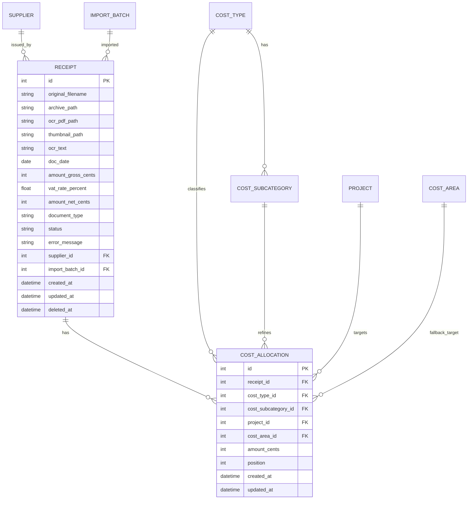

# Datenbankstruktur

Quelle: `belegmanager/models.py`, `belegmanager/db.py`, `belegmanager/fts.py`  
Version-Single-Source: `pyproject.toml` (`0.1.0`)

## Ueberblick
Die App nutzt SQLite mit SQLModel/SQLAlchemy.  
Hauptfokus liegt auf:
- `receipt` als Beleg-Stammsatz,
- `cost_allocation` als fachliche Zuordnungs-Wahrheit,
- Stammdaten (`project`, `supplier`, `cost_type`, `cost_subcategory`).

Zusatz:
- `receipt_fts` (FTS5) fuer Volltextsuche auf OCR-/PDF-Text.
- `import_batch` fuer Import-Statistik.

## ER-Uebersicht (vereinfacht)

## Tabellen und fachliche Rolle
- `receipt`: Belegkopf inkl. Betrag, Typ (`invoice`/`credit_note`), OCR-Status, Soft-Delete.
- `cost_allocation`: eine oder mehrere Zuordnungszeilen pro Beleg; Summe muss Beleg-Brutto entsprechen.
- `cost_type`: Kostenkategorie (aktiv/archiviert).
- `cost_subcategory`: Unterkategorie je Kostenkategorie, inkl. systemseitigem Default.
- `project`: optionale Projektzuordnung.
- `cost_area`: technische Zielstruktur; UI-seitig aktuell ausgeblendet, u. a. fuer Default-Fallback.
- `supplier`: Anbieter/Lieferant.
- `import_batch`: Importlauf (Zaehlwerte und Zeiten).

## Wichtige technische Konventionen
- Geldwerte in `*_cents` als Integer gespeichert.
- Timestamps in UTC.
- Soft-Delete ueber `receipt.deleted_at`.
- Volltextsuche ueber FTS5-Tabelle `receipt_fts(receipt_id, content)`.

## Migration, Seeds und Schema-Reset
Initialisierung in `db.init_db()`:
1. `_ensure_schema_state()`:
   - vergleicht Marker `data/schema_version.txt` mit internem `SCHEMA_VERSION`.
   - bei Abweichung: **Hard Reset** (DB-Datei + Archivordner neu).
2. `SQLModel.metadata.create_all(engine)`
3. `_apply_additive_migrations(session)`:
   - fuegt fehlende Spalten idempotent hinzu (z. B. `receipt.document_type`, `cost_type.active`, ...).
4. `init_fts(session)` fuer `receipt_fts`
5. `_seed_defaults(session)`:
   - Default-Kostenkategorien und Default-Unterkategorien
   - technische Default-Kostenstelle `Allgemeine Ausgabe`
   - Indexe fuer wichtige Filter/Join-Felder

## Warum diese Struktur
- Belegkopf + Zuordnungszeilen trennt Stammdaten und fachliche Verteilung sauber.
- Integer-Cents vermeiden Floating-Fehler bei Summen/Validierung.
- Soft-Delete bewahrt Historie und erlaubt Wiederherstellung.
- FTS5 in SQLite liefert lokal schnelle Suche ohne externen Dienst.
